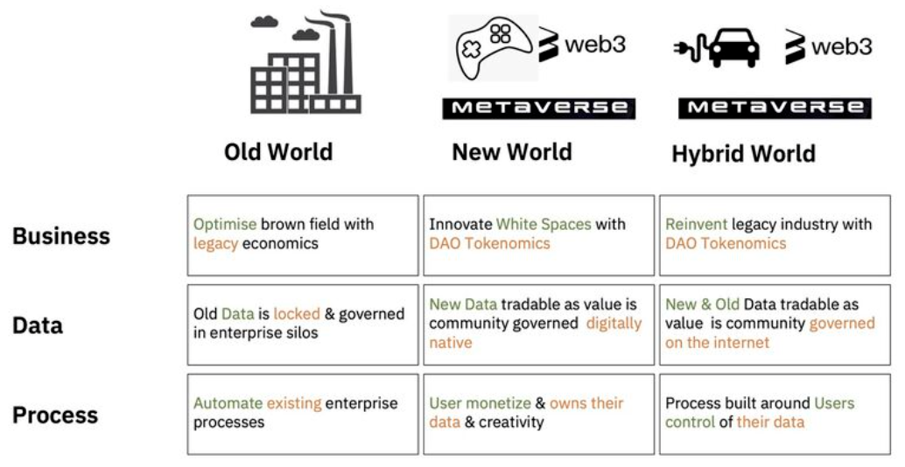

# What is dRimWeb?

**dRimWeb** is a DAO (Decetralized Autonomous Organization) with collective intelligence for building next generation of internet, specifically Web3 technologies and Metaverse.

Web3 and Metaverse technologies are exciting development, however, they are still some time away from becoming general purpose technology (GPT). dRimWeb DAO will first grasp the macro and to start break it down, split it up and then focus on the key impactful areas.

## Future State of Web3 and Metaverse?


**This is a working in progress document (for internal use only)**


The dRimWeb community ...

> Point 1
>
> Point 2
>
> — From the [an external link](https://support.loom.com/hc/en-us/articles/360002158057-What-is-Loom-)

> Point 3
>
> — From the [an external link](https://mailchimp.com/developer/marketing/docs/fundamentals/)

### Overview

**Got 2 minutes?** Check out a video overview of dRimWeb:



#### Jump right in

Look at the following to get to know dRimWeb:


[creating-your-first-project.md](overview/creating-your-first-project.md)



[creating-your-first-task.md](overview/creating-your-first-task.md)



[advanced-permissions.md](overview/advanced-permissions.md)


#### Dive a little deeper

Learn the fundamentals of the DAO design to get a deeper understanding of the DAO main features:


[projects.md](dao/projects.md)



[members.md](dao/members.md)



[task-lists.md](dao/task-lists.md)



[tasks.md](dao/tasks.md)

