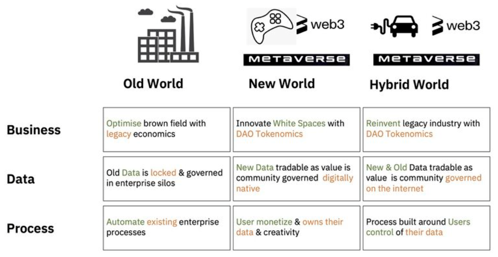

# What is dRimWeb?

**dRimWeb** is a DAO (Decetralized Autonomous Organization) focused on funding and developing public goods in Metaverse and Web3 technologies.

Web3 and Metaverse technologies are exciting development, however, they are still some time away from becoming general purpose technology (GPT). dRimWeb DAO will first grasp the macro and to start break it down, split it up and then focus on the key impactful areas.


**This is a working in progress document (for internal review before it is ready for public)**


**Got 2 minutes?** Check out a overview presentation deck of dRimWeb:

#### Overview

Look at the following to get to know dRimWeb:


[creating-your-first-project.md](overview/creating-your-first-project.md)



[creating-your-first-task.md](overview/creating-your-first-task.md)



[advanced-permissions.md](overview/advanced-permissions.md)


#### DAO

Learn the fundamentals of the DAO design to get a deeper understanding of the DAO main features:


[projects.md](dao/projects.md)



[members.md](dao/members.md)



[task-lists.md](dao/task-lists.md)



[tasks.md](dao/tasks.md)

